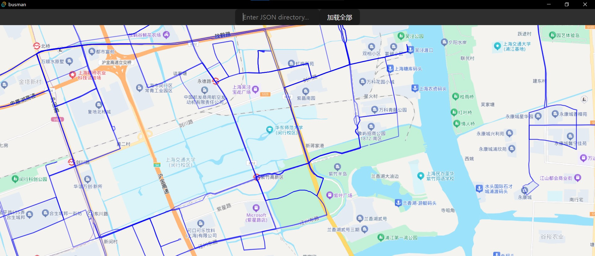

# Busman

Show many bus routes.

# Build

Prepare JSON file according to BusMan/src/main.ts and BusMan/src-tauri/src/lib.rs.

Fill your Baidu Map API KEY in BusMan/api-key.js.

Install Rust.

Then run `cargo install create-tauri-app --locked` to install Tauri.

Run `npm run tauri dev` to debug this project.

# TODO

Notify user when loading done.

Use different colors for different routes.

...
